<div align="center">

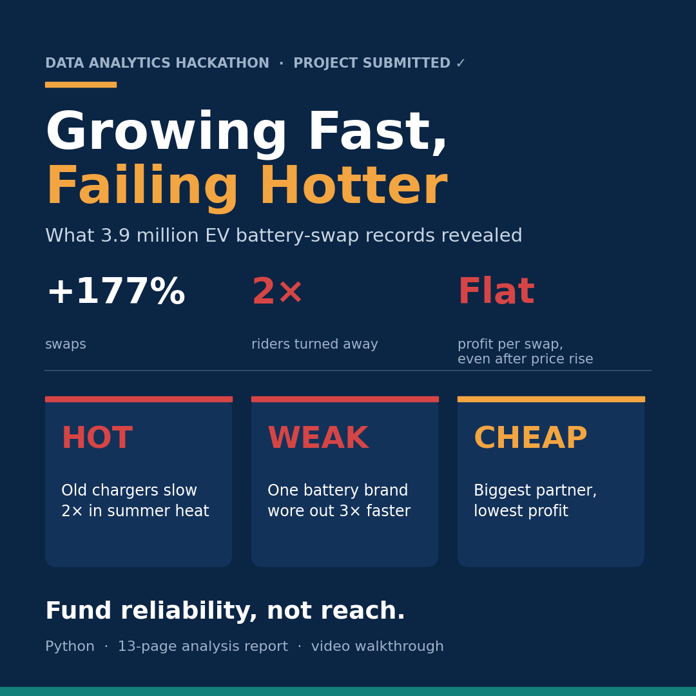

# ⚡ Growing Fast, Failing Hotter

### What 3.9 million EV battery-swap records reveal about a network that was growing and breaking at the same time


**Data Analytics Hackathon · Gradient Learnings · September 2026**

[📓 Notebook](VoltRelay_Final_Analysis.ipynb) · [📄 Full Report (PDF)](VoltRelay_Analysis_Report.pdf) · [🎥 Video Walkthrough](https://drive.google.com/file/d/12V_pUBpJhISpNgsJvnNbO1HxB-4pLz8p/view?usp=sharing)

</div>

---

## 🎯 TL;DR

> VoltRelay's swaps grew **+177%** and revenue **tripled**, but twice as many riders were turned away without a battery, fewer new riders stayed, and profit per swap stayed flat even after a price increase.
>
> The cause is three fixable problems: **🔥 HOT** (old chargers fail in summer heat), **🔋 WEAK** (one battery brand wore out 3× faster), and **🤝 CHEAP** (the biggest partner is the least profitable).
>
> **Recommendation: fund reliability, not reach.**

<div align="center">

| 📈 Swaps | 💰 Revenue | ❌ Visits with no battery | 🚶 New riders who stay | 💸 Profit per swap |
|:---:|:---:|:---:|:---:|:---:|
| **+177%** | **+200%** | **4.4% → 8.3%** | **88.4% → 84.5%** | **≈ flat** (+₹1.7) |

</div>

---

## 🛵 The Business Problem

**VoltRelay** runs unmanned battery-swap stations for delivery and bike-taxi riders in six Indian cities: Bengaluru, Delhi NCR, Hyderabad, Pune, Mumbai and Jaipur. A rider swaps an empty battery for a charged one in about two minutes.

Between **January 2024 and June 2025**, the company expanded in two waves, raised prices, piloted peak-hour pricing, added a battery supplier and renegotiated its biggest partner contract. Growth looked great, yet **service failures, rider churn and flat margins** told a different story.

**Leadership's question:** *What is really driving these outcomes, and where should next year's budget go?*

---

## 🗂️ The Data

| Table | Rows | What it contains |
|---|---:|---|
| `swap_events` | 3,877,013 | Every swap attempt: outcome, wait time, price, battery health |
| `station_hourly_status` | 1,487,712 | Hourly sensor data: stock, cabinet temperature, charge time |
| `riders` | 20,000 | Rider profile, city, plan, fleet partner |
| `batteries` | 6,500 | Supplier, batch, health, retirement |
| `support_tickets` | 44,000 | Complaints, categories, Hinglish comments, ratings |
| `stations` | 152 | Charger generation, location, expansion wave, costs |
| `city_daily_context` | 3,282 | Daily temperature, rainfall, festivals, outages |
| `fleet_partners` | 12 | Contract terms and discounts |

> ℹ️ The dataset is synthetic and belongs to the hackathon organizers, so it is **not included** in this repository.

---

## 🧭 Approach

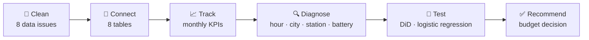

### 🧹 Data cleaning: finding the hidden traps

| Problem | Fix | Impact |
|---|---|---:|
| Internal test stations mixed into real data | Removed | 62,031 records |
| Firmware bug saved timestamps 5h 30m early (Mar–Apr 2025) | Corrected | 141,280 records |
| Same swap saved twice after network drops | De-duplicated | 1,370 records |
| Negative km and battery readings above 100% | Removed / capped | 21,140 readings |
| 21 spellings of 6 cities (`BLR`, `Bombay`, `Gurgaon`…) | Standardised | 100% mapped |
| Missing sensor data and biased ratings | Kept as missing, not zero; ratings not averaged blindly | — |

---

## 🔍 Key Findings

### 1️⃣ Growth hides a problem that returns every summer

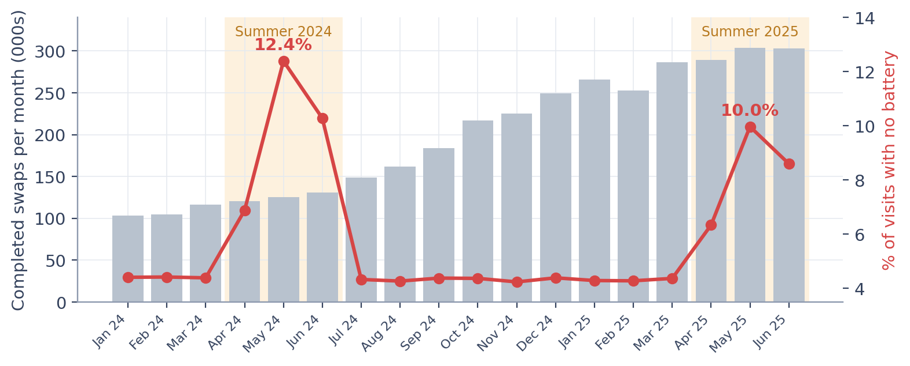

Normally about **4 in 100** visits end with no battery. In **May 2024** it was **12 in 100**, and in **May 2025** it was **10 in 100**.

---

### 2️⃣ 🔥 HOT: old chargers can't keep up in the heat

<table>
<tr>
<td>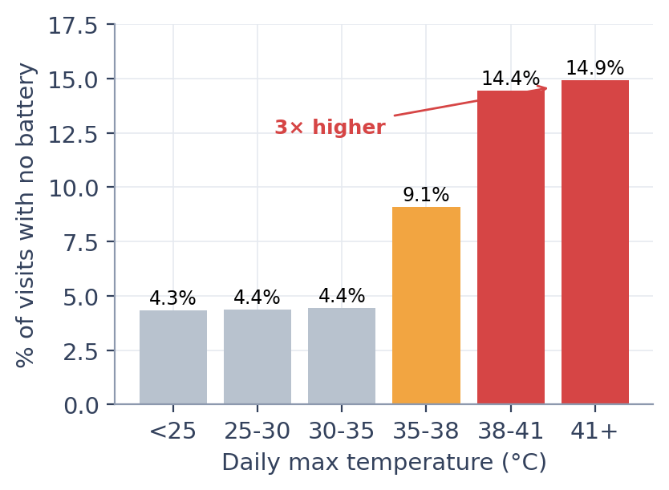</td>
<td>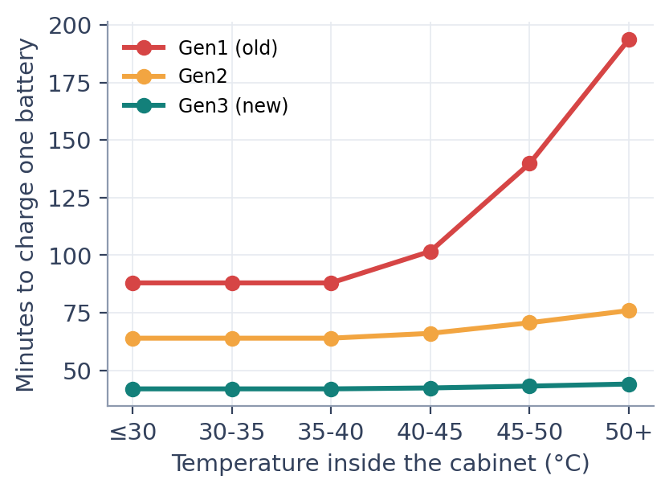</td>
</tr>
</table>

- Above **38°C**, riders are turned away **3× more often** (14.9% vs 4.4%).
- In hot cabinets, old **Gen1** chargers take up to **194 minutes** per battery instead of 88; **Gen3** stays at ~43.
- All **15 worst stations** are old Gen1 stations in **Jaipur, Delhi NCR and Hyderabad**.

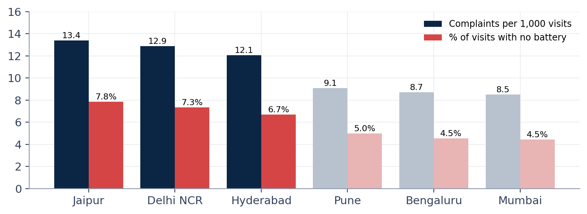

**Customers feel it:** the same hot cities raise **12–13 complaints per 1,000 visits** vs 8.5–9 elsewhere. And riders who leave usually **don't complain first**: new riders who raised a ticket actually stayed *more* (90.1% vs 85.9%).

---

### 3️⃣ 🏪 More stations won't fix it

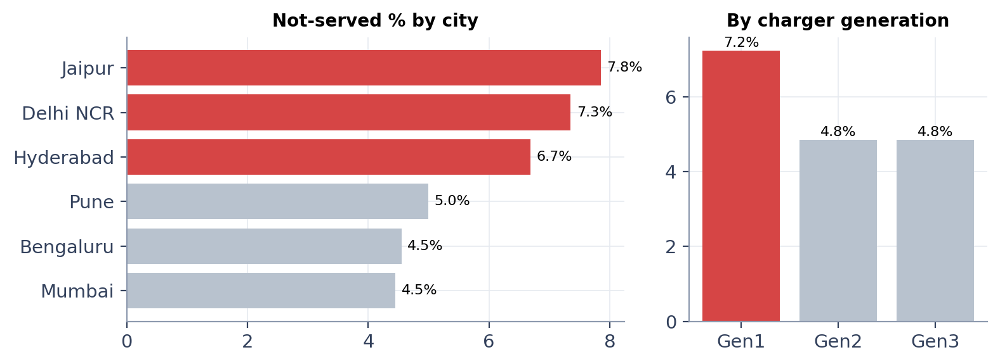

Charger age and city climate matter; location type and how busy a station is **do not**. The expansion waves opened mostly easy, low-demand sites, while the failing Gen1 stations were never upgraded.

---

### 4️⃣ 🔋 WEAK: one battery brand wore out 3× faster

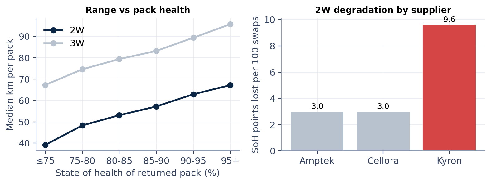

- **Kyron** 2W batteries lost **9.6 health points per 100 swaps** vs **3.0** for other brands.
- Riders got **48 km** per battery instead of **61 km**, so they had to swap more often.
- All **1,385** Kyron 2W packs are already retired.

---

### 5️⃣ 💸 Where the price rise went

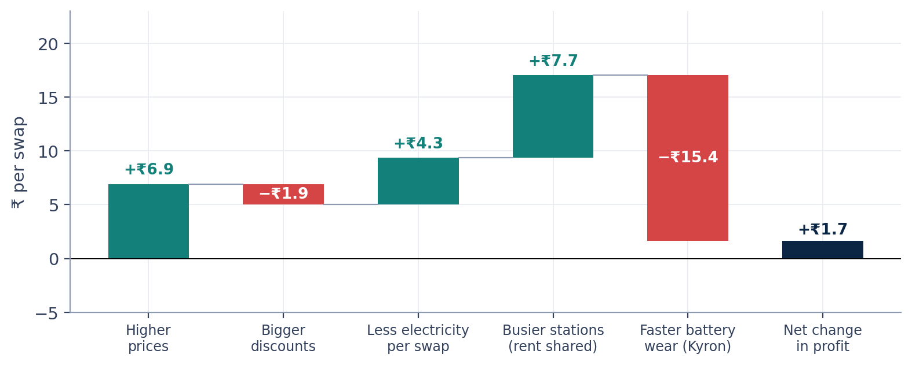

The price rise and scale savings added about **₹19 per swap**, but faster battery wear and bigger discounts took about **₹17** back. **Net: +₹1.7.**

> 📌 **Revenue ≠ profit.** Profit per swap = money in − electricity − battery wear − station rent.

**Peak-pricing pilot** (difference-in-differences vs 4 control cities): riders shifted only **−2.6 pts** out of peak hours, failures didn't improve, and revenue rose **+₹5.1 per swap**. *It earns more, but doesn't fix crowding.*

---

### 6️⃣ 🤝 CHEAP: the biggest partner is the least profitable

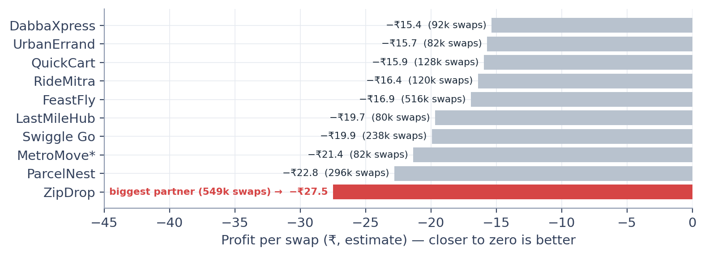

After **ZipDrop's** discount rose from **12% → 28%**, money per swap fell from ₹57.5 to ₹48.6 while its volume doubled, so every extra swap deepened the loss.

---

### 7️⃣ 🚶 Why new riders leave

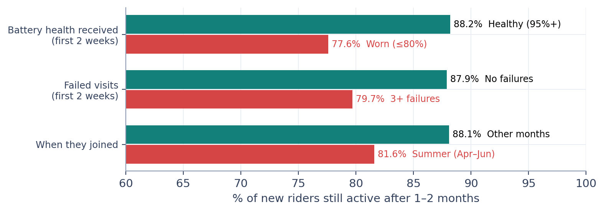

| Type | Reason | Evidence |
|---|---|---|
| 🔴 **Main** | Worn batteries in first 2 weeks | 77.6% stay vs 88.2% |
| 🔴 **Main** | Turned away 3+ times in first 2 weeks | 79.7% vs 87.9% |
| 🔴 **Main** | Joined in summer | 81.6% vs 88.1% |
| 🟡 Smaller | 3W riders, nearby competitor, unreliable first station | 3–6 pts lower |
| ⚪ Not a reason | KYC, sign-up channel, fleet vs independent | No significant difference |

*Validated with a multivariate logistic regression (battery health z ≈ 6.8; summer start z ≈ −6.1).*

---

## ✅ Recommendations: The Budget Decision

| Proposal | Verdict | What to do instead |
|---|:---:|---|
| 🏗️ More stations | 🟠 **Redirect** | Upgrade Gen1 → Gen3 chargers + cooling at the 15–20 worst hot-city stations before summer |
| 🔋 More batteries | 🟠 **Fix instead** | Replace Kyron packs; test every new supplier before buying at scale |
| 💲 Peak pricing everywhere | 🟢 **Limited** | Use it to earn more, charge it to all partners, don't expect it to fix crowding |
| 🤝 Exclusive with largest partner | 🔴 **Don't fund** | Renegotiate ZipDrop's discount to ~15% |
| 🆕 New riders | 🟢 **Fund** | "First 14 days" program: healthy batteries and reliable stations |

**Expected impact:** ~25% fewer riders turned away per year · ~₹15 per swap recovered (~₹4.5M/month) · both main churn drivers addressed.

---

## 🛠️ Tech Stack & Techniques

**Tools:** Python · Pandas · NumPy · Matplotlib · Seaborn · Jupyter · ReportLab

**Techniques:** Data cleaning & validation · Multi-table joins · Time-series KPI tracking · Sensor telemetry analysis · Cohort & retention analysis · Difference-in-differences · Logistic regression (NumPy, from scratch) · Unit economics / margin bridge · Data storytelling

---

## 📁 Repository Structure

```
voltrelay-ev-battery-swap-analysis/
├── VoltRelay_Final_Analysis.ipynb   # Full analysis: cleaning → Q1–Q6 → conclusions
├── VoltRelay_Analysis_Report.pdf    # 13-page business report
├── assets/                          # Charts and cover image
└── README.md
```

## ▶️ How to Run

```bash
# 1. Clone the repo
git clone https://github.com/spidernestdev/voltrelay-ev-battery-swap-analysis.git
cd voltrelay-ev-battery-swap-analysis

# 2. Install dependencies
pip install pandas numpy matplotlib seaborn pyarrow jupyter

# 3. Put the 8 hackathon CSV files in ./data/ and run
jupyter notebook VoltRelay_Final_Analysis.ipynb
```

> 💡 The notebook also runs in **Google Colab**: it auto-mounts Google Drive and reads from a `voltrelay` folder.

---

## ⚠️ Limitations

- Observational data shows strong **associations, not proof of causation**; a driver is called "main" only when several views agree.
- Battery wear cost relies on an assumed 70% end-of-service battery health; the **trend** is robust, the absolute level is an estimate.
- Synthetic dataset; all company names are fictional.

## 🤖 AI Disclosure

Analysis code, charts and the report were developed with the help of **Claude (Anthropic)** and reviewed by the team, as required by the hackathon rules.

---

<div align="center">

**Built by [@spidernestdev](https://github.com/spidernestdev)**

*If you found this analysis interesting, consider giving it a ⭐*

</div>
